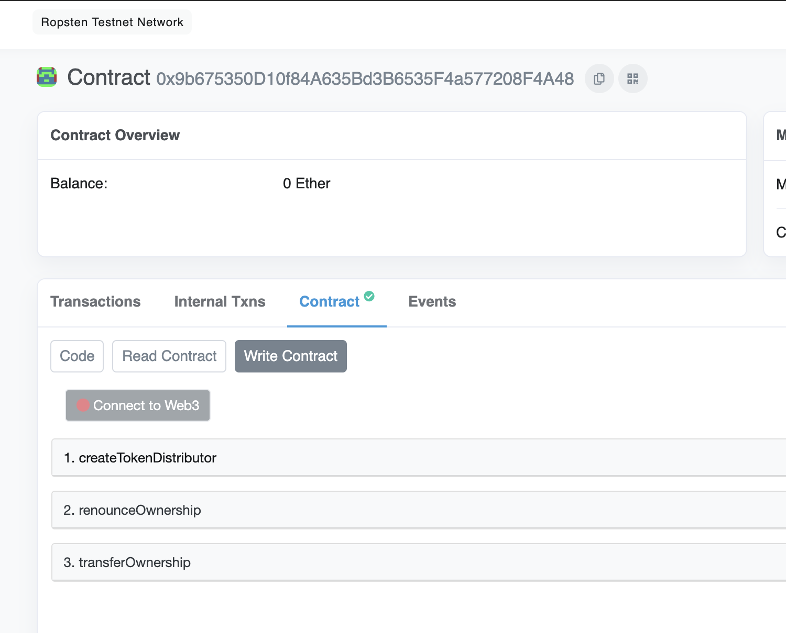
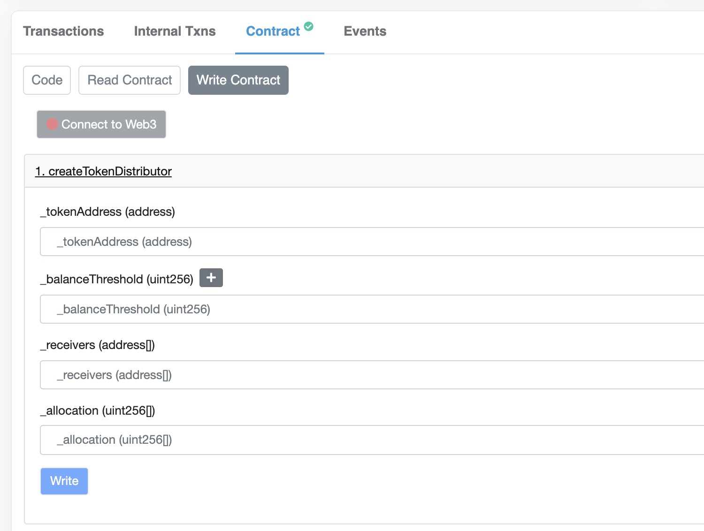
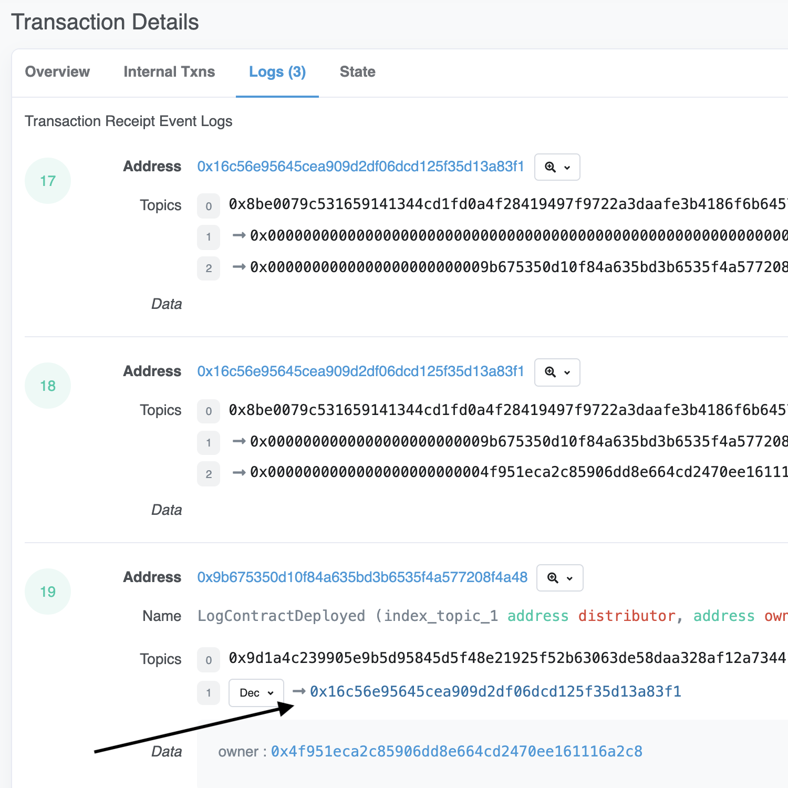
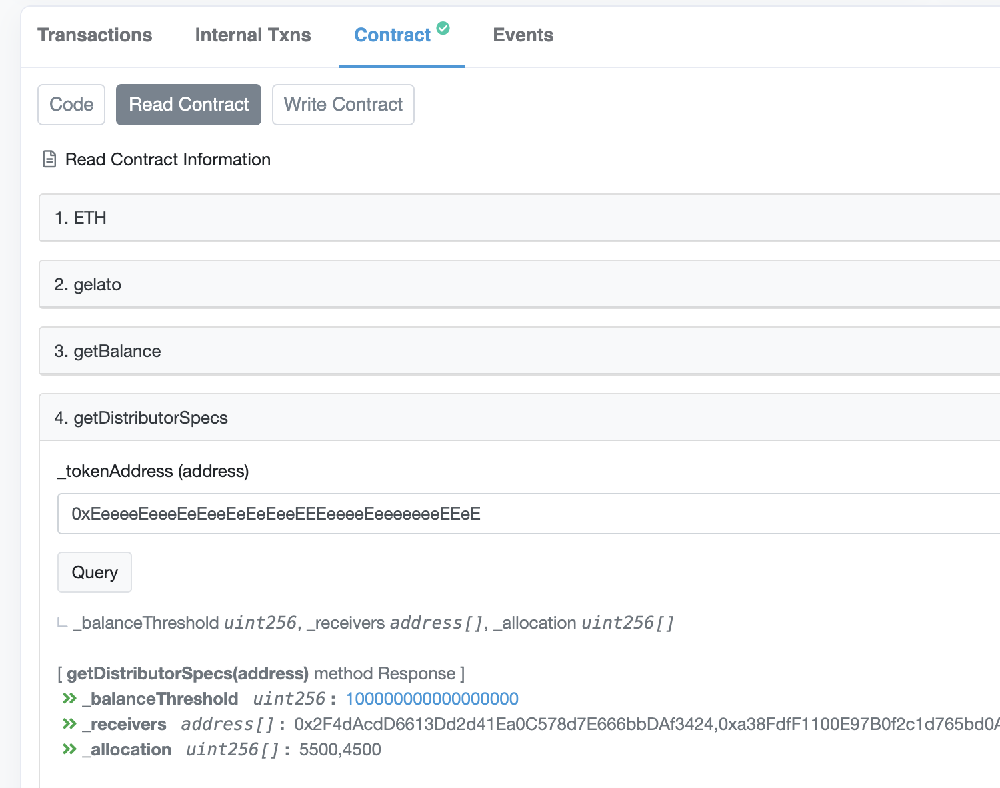

# Gelato Token Distributor

## Description

`TokenDistributor` automatically sends tokens to multiple receivers with specified allocations when a threshold is reached.

## Addresses

### Ropsten:

- [AutoTopUpFactory](https://ropsten.etherscan.io/address/0x9b675350D10f84A635Bd3B6535F4a577208F4A48)

## Tutorial - Deploying your own instance of `TokenDistributor` with `TokenDistributorFactory`

1. Visit the AutoTopUpFactory Page on [Etherscan](https://ropsten.etherscan.io/address/0x9b675350D10f84A635Bd3B6535F4a577208F4A48)
   
2. Connect to your Web3 Wallet and click `createTokenDistributor`
   
3. Fill in the details of `createTokenDistributor`.
   1. \_tokenAddress: The address of the token you want `TokenDistributor` to monitor. For ETH, use `0xEeeeeEeeeEeEeeEeEeEeeEEEeeeeEeeeeeeeEEeE`.
   2. \_balanceThreshold: The token balance which will trigger distribute.
   3. \_receivers: Array of receivers who tokens will be distributed to.
   4. \_allocation: Array of percentages each representing the percentage of \_balanceThreshold which will be received by each \_receivers. Percentages can have a maximum of 3 decimal places. For 51.456%, `51456` will be the input.
4. Click Write and submit the transaction
5. Go to Logs of the transaction and to find your `TokenDistributor` address.
   
6. Git clone this repo and complete Local Setup.
7. Verify your contract by running:

```
npx hardhat verify --network ropsten YOUR_TOKEN_DISTRIBUTOR_ADDRESS "0xCc4CcD69D31F9FfDBD3BFfDe49c6aA886DaB98d9"
```

8. Use `getDistributorSpecs` to check out the specs of distributor which was set up previously.
   
9. To withdraw funds, use the `withdraw` function.

## Local Setup

1. Put in your `ALCHEMY_ROPSTEN`, `PRIVATE_KEY`, `ETHERSCAN_API` in `.env`
2. Run `yarn`

## Tests

Run: `yarn test`
